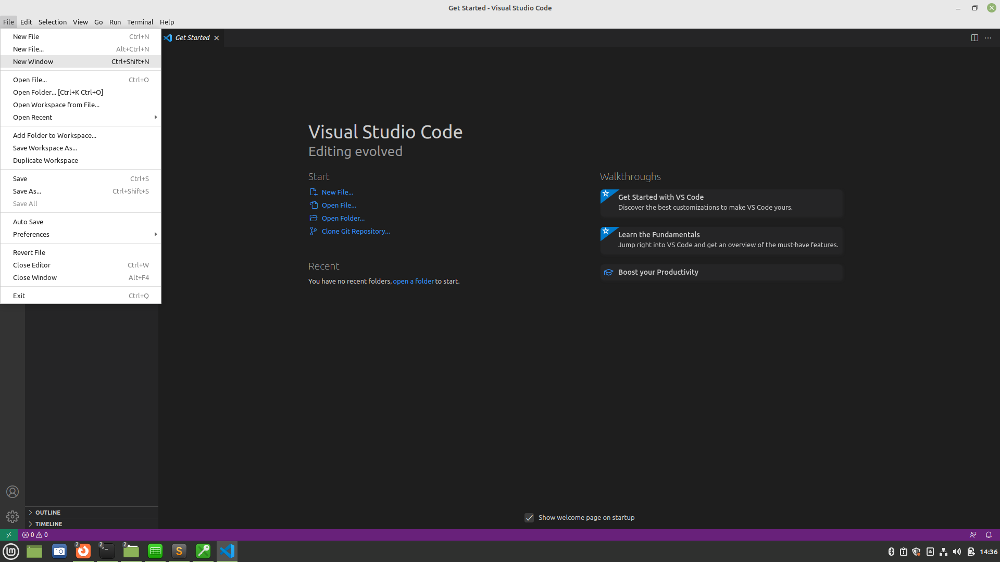
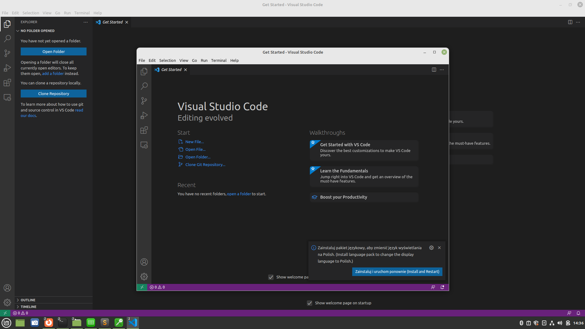
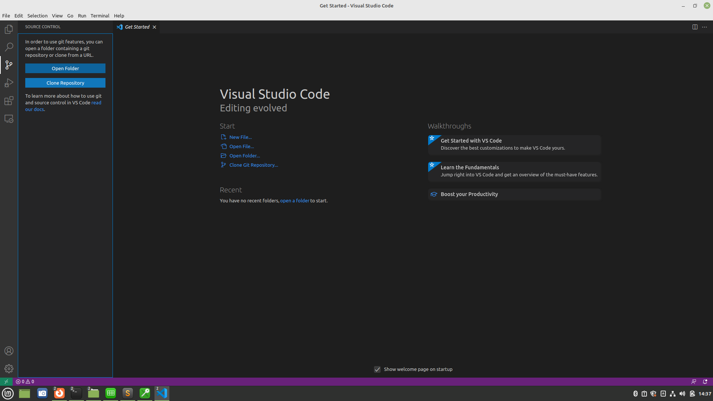
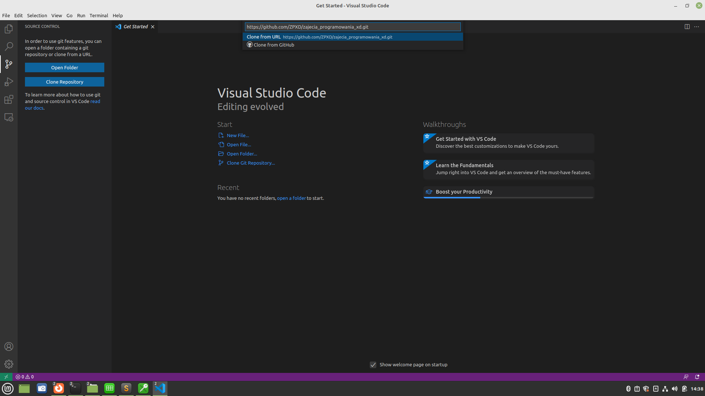
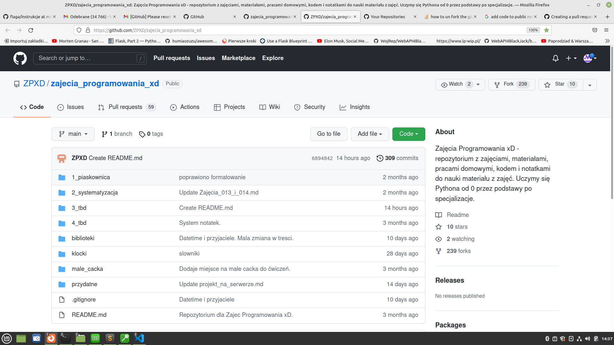
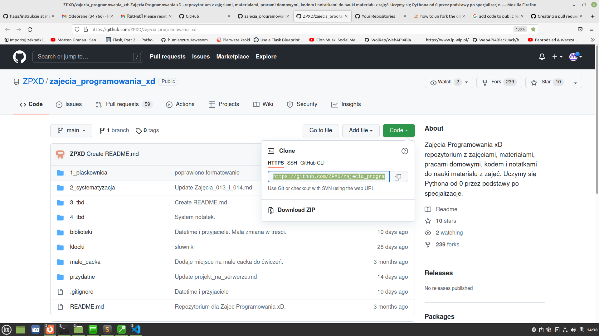
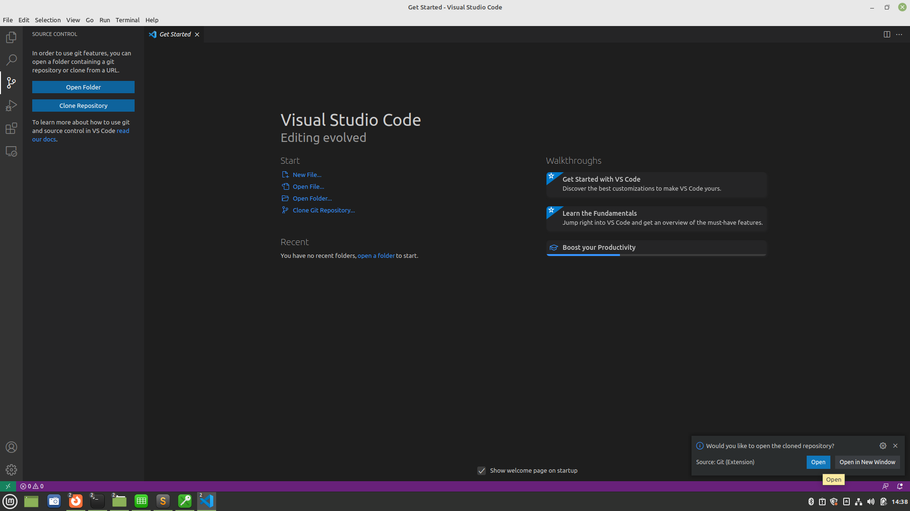
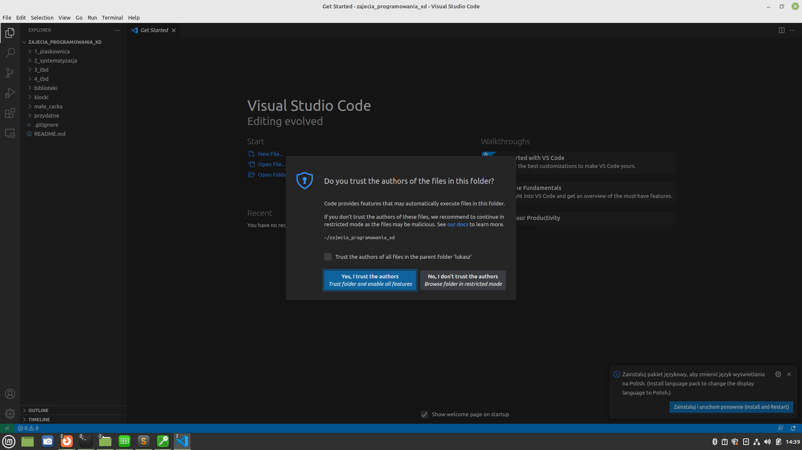

## Pobierz repozytorium - git clone

**W terminalu:**

Otwórz terminal i pobierz tam gdzie jesteś:
```
git clone https://github.com/ZPXD/zajecia_programowania_xd.git
```
Albo do wybranego folderu:
```
git clone https://github.com/ZPXD/zajecia_programowania_xd.git nazwa_folderu
```

**W VSCode:**

To co poniżej opisane jest zasadniczo proste, krótkie i trwa 15 sekund, jednak na potrzeby stabilności zapisałem to tak, aby nie było wątpliwości jak przeprowadzić pobranie repozytorium. 

1. Otwórz VSCode i otwórz nowe okno


2. Otwórz nowe okno


3. Kliknij w 3 klocek od góry po lewej z "SOURCE CONTROL"


4. Kliknij w VSCode w niebieski przycisk z lewej strony "Clone Repository" - wyświetli się pole na link na górze strony po środku. 


5. Wejdź na stronę repozytorium które chcesz pobrać


6. Kliknij w zielony przycisk "code" i skopiuj jego url HTTPS. Wróć do VSCode, wklej URL i kliknij Clone from URL. Repozytorium pobierze się tam gdzie wskarzesz. Polecam wybrać miejsce na repozytoria, repozytoria z zajęć.


7. Na dole po prawej stronie pojawi się mały niebieski przycisk "Open" - kliknij w niego a otworzysz folder pobranego repozytorium.


8. Zaznacz, że ufasz plikom. TBH plikom nie należy przesadnie ufać jeżeli nie znamy ich źródła. W tym celu ruszył projekt pychecker gdzie sprawdzisz pobierany kod aby upewnić się, że nie ma tam wirusów ani niebezpiecznych programow, niebezpiecznego kodu.

