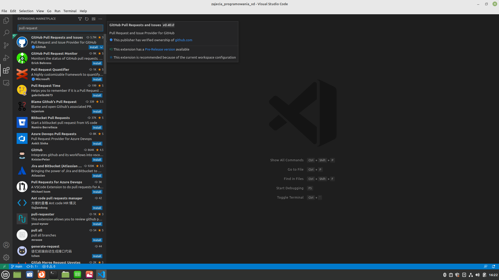
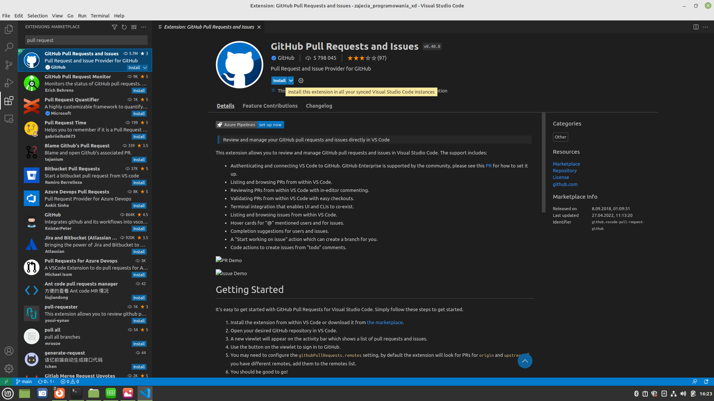

## Pobierz w VSCode github Pull Request

Jeżeli jeszcze nie masz, pobierz rozszerzenie VSCode do Pull Requests (PR)

1a. Znajdź rozszerzenie VSCode Pull Requests (PR):

1b. Zainstaluj (na serwerze, ale na komputerze też się przyda):

