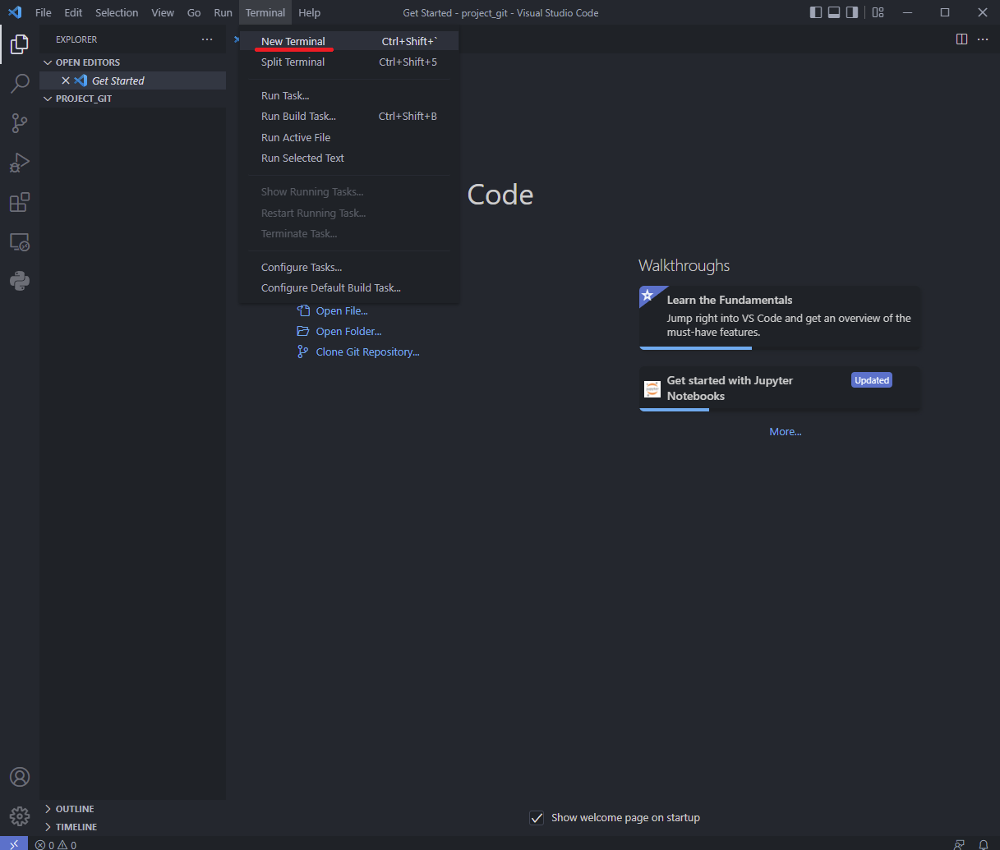
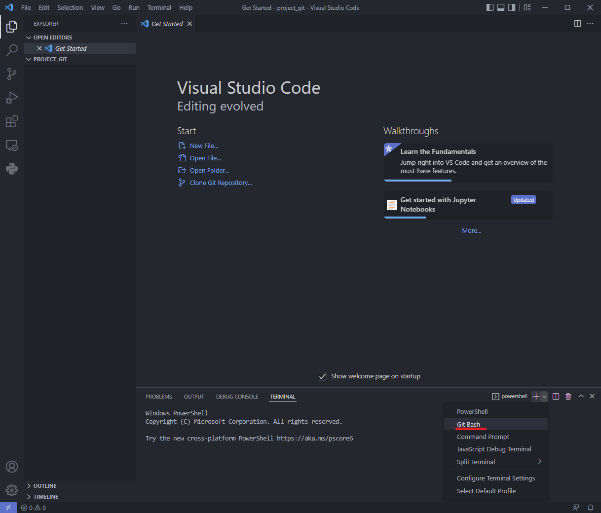

## Uruchom projekt u siebie na komputerze z systemem Windows 10/11
### II. Pobierz i uruchom projekt
#### (git bash, git clone, środowisko, biblioteki i uruchomienie projektu)

#### W instrukcji będziemy korzystać z git bash zamiast powershell

1. Zainstaluj gita wraz z git bash [download_git_windows](https://git-scm.com/download/win)
2. Utwórz nowy folder przeznaczony na projekt, następnie uruchom VSC i otwórz ten folder.
3. Wejdź na stornę główną repozytorium projektu - np. `https://github.com/ZPXD/arena.xd`.
4. Znajdź zielony przycisk `code`
5. Skopiuj url `https://github.com/ZPXD/arena.xd.git`

### Uruchom nowy terminal Git Bash




Uruchom poniższą komendę zamieniając `repo_url` na skopiowany w poprzednim kroku url projektu
```
repo_url=<tu_wklej_url>

```
Sklonuj repozytorium (1 linia)  i utwórz środowisko na podstawie nazwy folderu z dopiskiem "env"(2 i 3 linijka), aktywuj środowisko(4 linijka) :
```
git clone $repo_url
srodowisko="${PWD##*/}env"
python -m venv $srodowisko
source $srodowisko/Scripts/activate
```
Przejdź do folderu z projektem (1,2,3 linia automatycznie przechodzi do folderu z projektem, lub przejdź ręcznie wpisując cd <nazwa_folderu>) i zainstaluj wymagane biblioteki zapisane w pliku requirements.txt: 
```
folder_git=${repo_url##*/}
folder_git=${folder_git%.git}
cd $folder_git
pip install -r requirements.txt
```
i jeżeli projekt ma formę strony www:
```
export FLASK_APP=app.py
flask run
```
Po odpaleniu aplikacji wejdź na http://127.0.0.1:5000/ 

Uruchom flask w trybie debug:
```
export FLASK_ENV=development
flask run
```
wejdź na http://127.0.0.1:5000

a jeżeli projekt ma formę skryptu (sprawdzisz skrypty w folderze wpisując `ls`):
```
python3 nazwa_skryptu.py
```

#### Aby wyjść ze środowiska, wpisz:
```
deactivate
```

#### Aby ponownie aktywować środowisko, wpisz:
```
source $srodowisko/Scripts/activate
```
lub
```
source <nazwa_folderu_ze_srodowiskiem>/Scripts/activate
```
