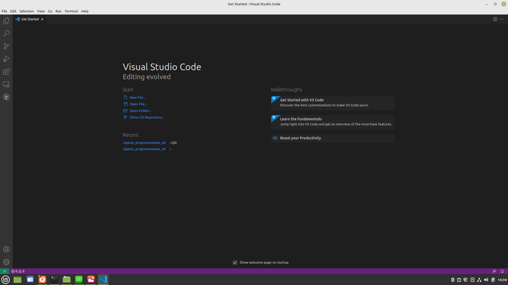
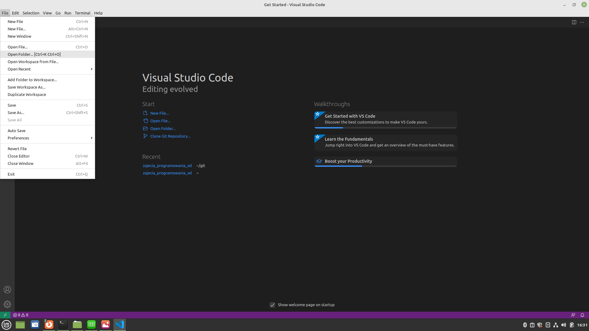
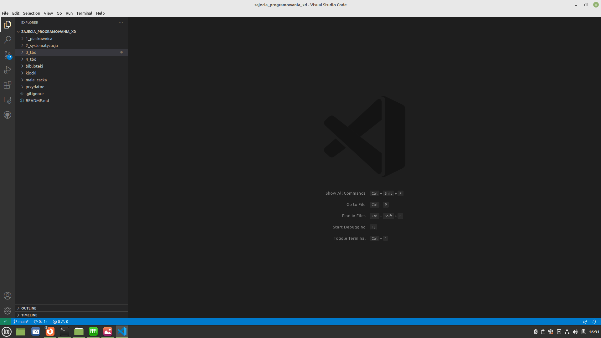
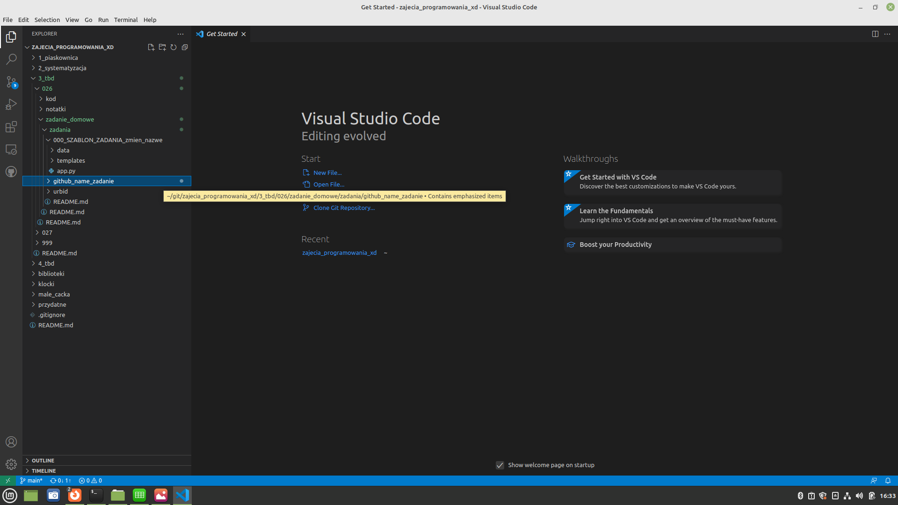

## Prześlij zadanie domowe

1. Pobierz repozytorium
2. Stwórz szablon zadania domowego.
3. Wedjdź w utworzony folder z Twoim zadaniem. Jak ukończysz zadanie, zapisz plik.
4. Zrób Pull Requesta (PR).


#### 1. Pobierz repozytorium

W terminalu wejdź do folderu w którym chcesz pobrać repozytorium i wypisz:
```
git clone https://github.com/ZPXD/zajecia_programowania_xd.git
```

W VSCode wedle instrukcji: https://github.com/ZPXD/zajecia_programowania_xd/blob/main/przydatne/git_clone.md

#### 2. Szablon zadania domowego.

W terminalu wejdź do folderu z zadaniem domowym:
```
cd zajecia_programowania_xd/3_tbd/026
cd zadanie_domowe/zadania
```

Skopiuj szablon odpowiedzi i zapisz go pod swoją nazwą z githuba lub discorda:
```
cp -r 000_SZABLON_ZADANIA_zmien_nazwe imie_github_zadanie_domowe
```

1. Otwórz VSCode


2. Otwórz pobrane repozytorium w nowym oknie


3. Znajdź folder zajęć (np. 3_tbd/026 ) a w nim folder zadanie_domowe/zadania a tam folder z szablonem 


4. Stwórz kopię pliku czy folderu z szablonem i zapisz pod swoją nazwą na github/discord



#### 3. Zadanie domowe.

Wejdź w utworzony folder z Twoim zadaniem i zrealizuj zadanie zgodnie z jego treścią opisaną w folderze zajęć jako `zadanie_domowe/README.md`. Jak ukończysz zadanie, zapisz plik.

W terminalu:
```
cd imie_github_zadanie_domowe
code app.py # jeżeli używasz VSCode, albo subl app.py jeżeli używasz Sublime 
```

W VSCode - powinieneś być we właściwym miejscu po ukończeniu poprzedniego kroku. Edytuj kod i zapisz jak skończysz.

#### 4. Zrób Pull Requesta (PR).

W VSCode:

1. Jeżeli jeszcze nie masz, [Pobierz VSCode Pull Requests](https://github.com/ZPXD/zajecia_programowania_xd/blob/main/przydatne/pobierz_github_pull_requests.md)

2. Zadanie zapisane? Zrób PR:


